# vBlog Core

一个面向极客和 Vibe Coder 的可自定义轻量博客系统。使用 Markdown 写作，支持组件自定义、标签分类、评论系统、RSS 订阅、gRPC 实时监控等功能。

## 功能特性

### 博客前台

- **首页**：文章列表、统计概览、Ctrl+F 搜索、分页浏览（支持页码跳转）

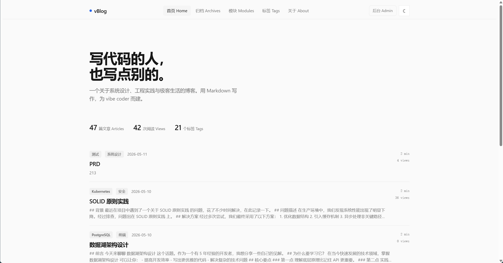

- **文章详情**：Markdown 渲染、代码高亮、目录导航（TOC）、阅读量统计、上/下篇导航

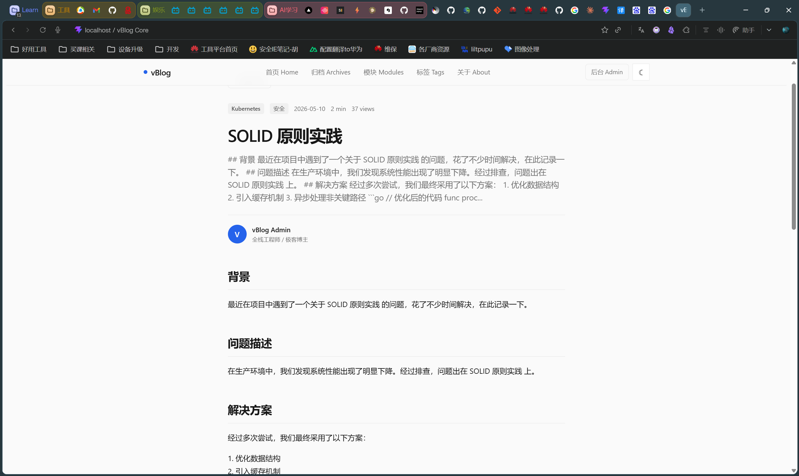

- **归档页面**：按时间线浏览所有文章

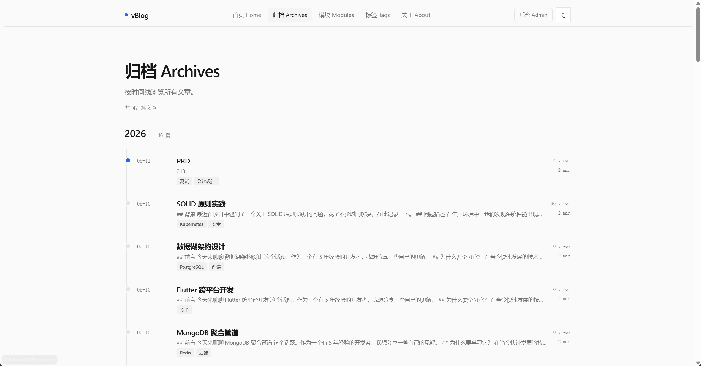

- **标签页面**：按标签分类浏览，显示每个标签对应的文章数量

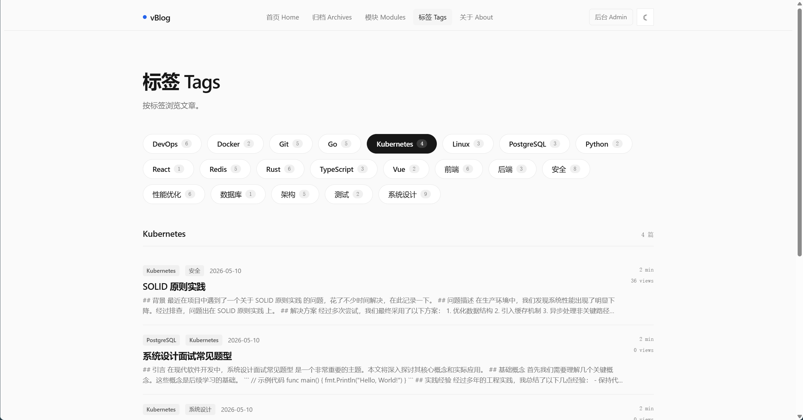

- **关于页面**：博主信息展示

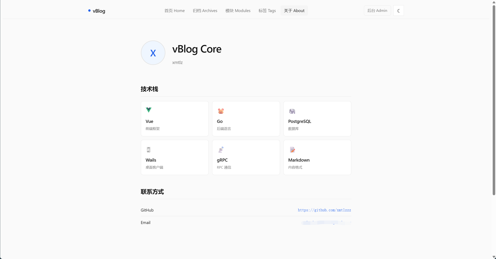

- **评论系统**：访客评论，管理员可开关

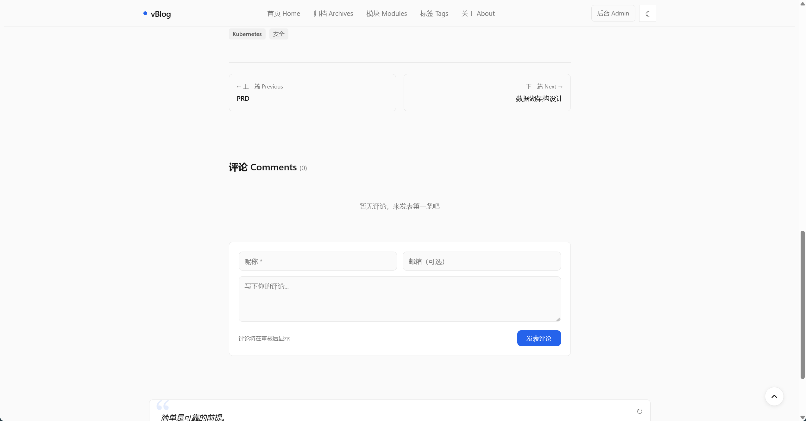

- **RSS 订阅**：自动生成 RSS 2.0 Feed


- **主题切换**：亮色/暗色主题，自动持久化


### 后台管理

- **仪表盘**：文章总数、总阅读量、评论数、标签数统计

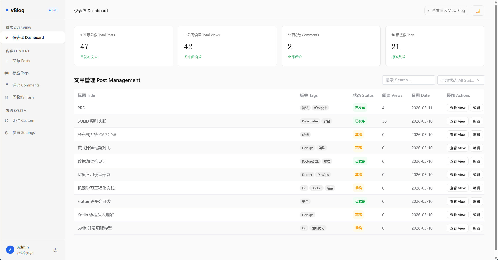


- **文章管理**：创建、编辑、删除文章；Markdown 编辑器（md-editor-v3）支持图片上传；Markdown 文件导入

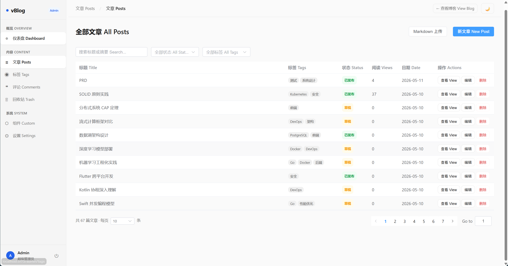

- **回收站**：文章软删除后进入回收站，支持恢复和彻底删除

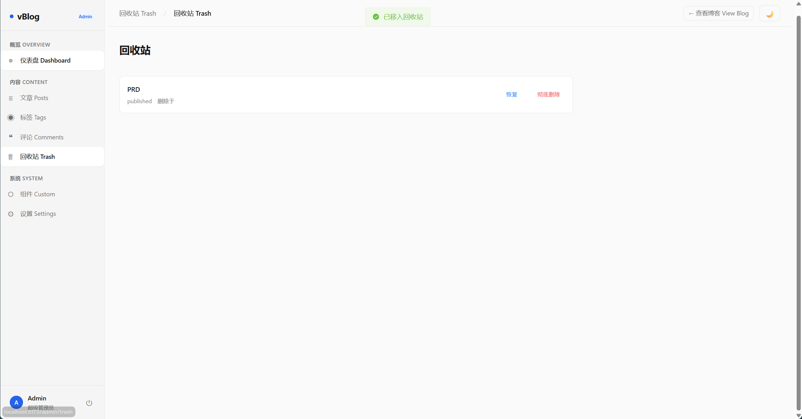

- **标签管理**：标签 CRUD，显示文章计数

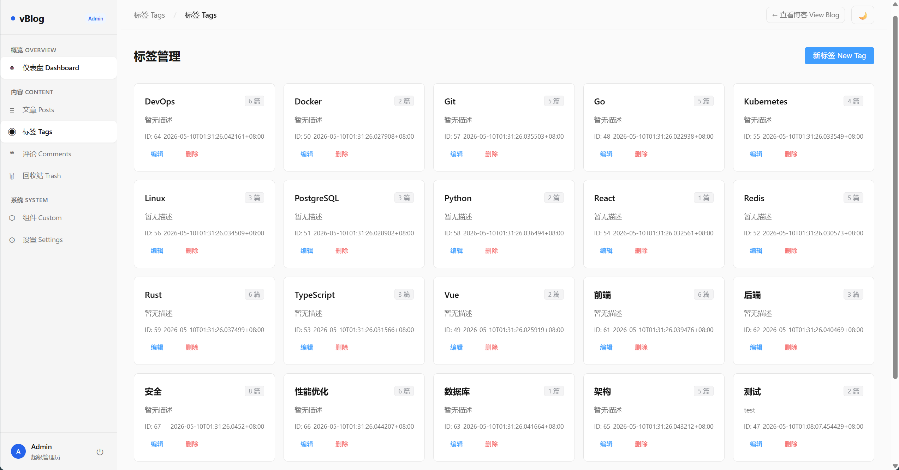

- **评论管理**：查看、删除评论

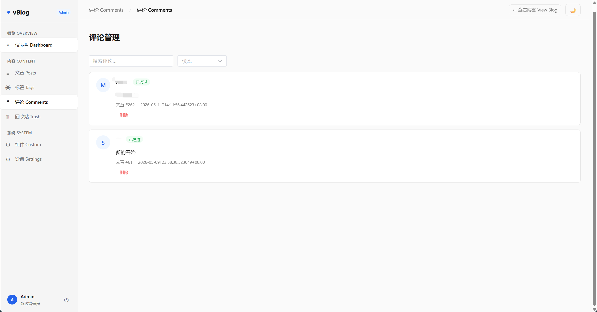

- **组件自定义**：iframe 沙盒自定义组件，支持启用/禁用切换，组件可读取博客数据

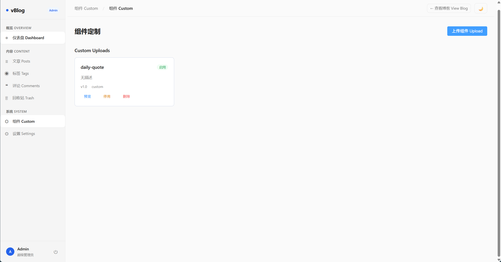

- **系统设置**：站点信息、作者信息、功能开关、gRPC API Key 管理

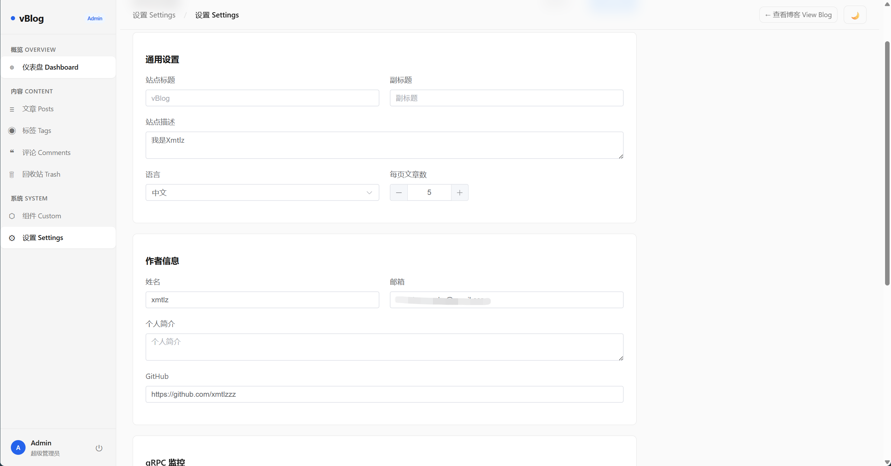

- **图片上传**：编辑器内粘贴/拖拽图片自动上传

### gRPC 实时监控

- **数据统计**：PV/UV 访问量、文章阅读量、评论数、标签数
- **趋势对比**：支持日/周/月维度的趋势数据
- **实时推送**：gRPC 双向流，新文章/评论/里程碑事件实时推送到客户端
- **桌面客户端**：Wails v2 桌面应用，通知/变动中心风格 UI

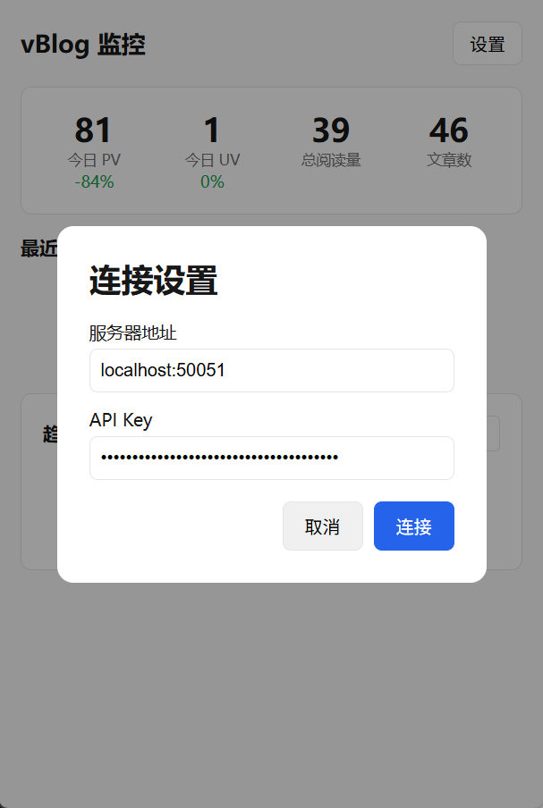

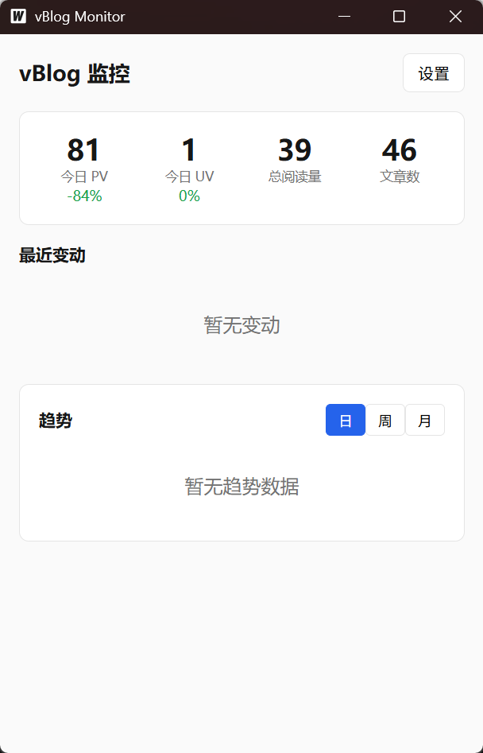

## 技术栈

| 层级 | 技术 |
|------|------|
| 前端 | Vue 3 + Element Plus + Pinia + Vue Router 4 + md-editor-v3 |
| 后端 | Go + go-restful/v3 + GORM + gRPC |
| 数据库 | PostgreSQL |
| 认证 | JWT（golang-jwt/v5）+ API Key（gRPC） |
| 配置 | Viper + TOML |
| 前端构建 | Vite |
| 桌面客户端 | Wails v2 + Vue 3 |

## 项目结构

```
vBlog Core/
├── server/                  # Go 后端
│   ├── cmd/
│   │   ├── main.go          # 服务入口（HTTP + gRPC）
│   │   └── seed/            # 测试数据种子脚本
│   ├── api/                 # REST API 处理器
│   │   ├── post.go          # 文章 API（含回收站）
│   │   ├── tag.go           # 标签 API
│   │   ├── comment.go       # 评论 API
│   │   ├── setting.go       # 设置 API
│   │   ├── auth.go          # 登录/注册 API
│   │   ├── component.go     # 组件 API
│   │   ├── dashboard.go     # 仪表盘统计 API
│   │   ├── rss.go           # RSS Feed
│   │   └── upload.go        # 图片上传 API
│   ├── grpc/                # gRPC 服务
│   │   ├── server.go        # gRPC 服务器（GetLatestStats, GetTrends, WatchChanges）
│   │   ├── auth.go          # API Key 认证拦截器
│   │   └── analytics_test.go
│   ├── proto/               # Protobuf 定义与生成代码
│   ├── service/             # 业务逻辑层
│   ├── model/               # 数据模型（GORM）
│   ├── middleware/           # JWT 中间件 + PV 记录中间件
│   └── config/              # 配置（Viper + TOML）
├── client/                  # Wails 桌面客户端
│   ├── app.go               # 应用逻辑（gRPC 连接、数据获取）
│   ├── main.go              # Wails 入口
│   └── frontend/            # Vue 3 前端
│       └── src/
│           ├── App.vue      # 主界面
│           └── components/  # StatsBar, ChangeCard, TrendPanel, Settings
├── web/                     # Vue 3 前端（博客 + 后台）
│   └── src/
│       ├── blog/            # 博客前台页面
│       ├── admin/           # 后台管理页面（含回收站）
│       ├── shared/          # 共享组件（导航、页脚、CustomWidgets）
│       ├── stores/          # Pinia 状态管理
│       ├── api/             # Axios 请求封装
│       ├── styles/          # 全局样式与设计变量
│       └── utils/           # 工具函数（含组件检测脚本）
├── test-components/         # 测试组件脚本
├── hdx/                     # HTML 原型（UI 参考）
├── docs/                    # 文档（PRD、设计规格、实现计划）
└── deploy/                  # 部署配置
```

## 快速开始

### 环境要求

- Go 1.22+
- Node.js 18+
- PostgreSQL 14+

### 1. 配置数据库

创建 PostgreSQL 数据库：

```sql
CREATE DATABASE vblog;
CREATE USER vblog WITH PASSWORD 'your_password';
GRANT ALL PRIVILEGES ON DATABASE vblog TO vblog;
```

### 2. 修改配置文件

编辑 `server/config/config.toml`：

```toml
[http]
addr = "0.0.0.0"
port = 8080

[postgres]
host = "127.0.0.1"
port = 5432
name = "vblog"
user = "vblog"
password = "your_password"

[jwt]
secret = "your-jwt-secret"
```

### 3. 启动后端

```bash
cd server
go run ./cmd/main.go
```

后端启动后自动创建数据库表结构，监听 `0.0.0.0:8080`。

### 4. 启动前端

```bash
cd web
npm install
npm run dev
```

前端开发服务器运行在 `http://localhost:5173`，API 请求自动代理到 `http://localhost:8080`。

### 5. 构建生产版本

```bash
cd web
npm run build
```

构建产物输出到 `web/dist/`。将 `dist/` 目录内容复制到 `server/static/`，Go 服务器会自动提供静态文件服务并处理 SPA 路由。

### 6. 注册管理员

首次使用需注册管理员账号：

1. 访问 `/admin/register` 注册账号
2. 登录后即可进入后台管理

### 7. 填充测试数据（可选）

```bash
cd server
go run ./cmd/seed/
```

自动创建 50 篇测试文章和 20 个标签。

## 运行测试

```bash
cd server
go test ./... -v
```

项目采用 TDD 开发模式，每个模块的测试文件与实现在同一目录下。

## API 接口

### 公开接口

| 方法 | 路径 | 说明 |
|------|------|------|
| GET | `/api/posts` | 文章列表（支持分页、搜索、标签筛选） |
| GET | `/api/posts/{id}` | 文章详情（自动递增阅读量） |
| GET | `/api/tags` | 标签列表（含文章计数） |
| GET | `/api/comments?post_id={id}` | 文章评论 |
| POST | `/api/comments` | 提交评论 |
| GET | `/api/settings` | 站点设置 |
| GET | `/api/dashboard/stats` | 统计数据 |
| POST | `/api/auth/login` | 用户登录 |
| POST | `/api/auth/register` | 用户注册 |
| GET | `/api/rss` | RSS Feed |

### 管理接口（需 JWT）

| 方法 | 路径 | 说明 |
|------|------|------|
| POST | `/api/posts` | 创建文章 |
| PUT | `/api/posts/{id}` | 更新文章 |
| DELETE | `/api/posts/{id}` | 删除文章（移入回收站） |
| GET | `/api/posts/trash` | 回收站列表 |
| POST | `/api/posts/{id}/restore` | 恢复文章 |
| DELETE | `/api/posts/{id}/permanent` | 彻底删除 |
| POST/PUT/DELETE | `/api/tags` | 标签 CRUD |
| PUT | `/api/settings` | 保存设置 |
| POST | `/api/upload` | 上传图片 |
| CRUD | `/api/components` | 组件管理 |

### gRPC 接口（端口 50051）

| RPC | 说明 |
|-----|------|
| `Ping` | 心跳检测 |
| `GetLatestStats` | 获取最新统计数据（PV/UV、文章数、阅读量等） |
| `GetTrends` | 获取趋势数据（支持 day/week/month 粒度） |
| `WatchChanges` | 服务端流式推送变动事件（需 API Key 认证） |

## 桌面客户端

Wails v2 桌面监控客户端，连接博客 gRPC 服务实时查看数据。

### 功能

- **统计概览**：今日 PV/UV、总阅读量、文章数，支持日环比
- **变动通知**：新文章、新评论、阅读里程碑等实时推送
- **趋势图表**：日/周/月维度的 PV/UV 趋势
- **连接管理**：服务器地址 + API Key 配置，本地持久化

### 构建与运行

```bash
cd client
wails build        # 构建生产版本
wails dev          # 开发模式（热重载）
```

构建产物：`client/build/bin/vBlog-Monitor.exe`

### 使用流程

1. 后台设置 → gRPC 监控 → 生成 API Key
2. 启动客户端 → 设置 → 输入服务器地址和 API Key → 连接
3. 客户端自动每 10 秒刷新数据，变动事件实时推送

## 设计系统

项目使用 CSS 变量实现主题系统，定义在 `web/src/styles/variables.css`：

```css
/* 亮色主题 */
--bg: #fafafa; --surface: #ffffff; --fg: #171717; --muted: #737373;
--border: #e5e5e5; --accent: #2563eb; --accent-soft: #eff6ff;

/* 暗色主题 */
--bg: #0a0a0a; --surface: #141414; --fg: #ededed; --muted: #a3a3a3;
--border: #262626; --accent: #3b82f6; --accent-soft: #172554;
```

主题切换通过 `data-theme="dark"` 属性实现，自动持久化到 localStorage。

## 许可证

MIT
